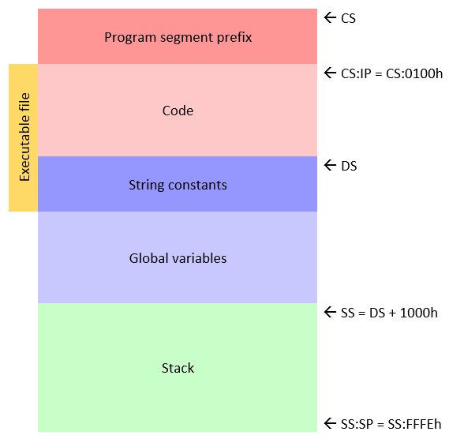

# XD Pascal Compiler

## Summary
A small educational compiler for a subset of the Pascal language. A native x86 machine code generator directly emits COM executables for MS-DOS. The compiler supports VGA graphics, floating-point arithmetic, etc. 32-bit Pascal source is provided.

### Features
* Fast recursive descent parsing
* Native x86 code generation (COM executables)
* No external assembler or linker
* Source file inclusion facility
* Single-precision floating-point arithmetic (using the x87 FPU)
* VGA graphics support
* Compiler source for both Windows (Delphi) and DOS (TMT Pascal)

## Detailed description
### Preamble
The software is in the public domain. It comes with absolutely no warranty.
Any comments, suggestions, or bug reports are VERY MUCH appreciated. 
Feel free to contact me via e-mail. 
Enjoy.

### Usage
Type in the command prompt:
```
xdp <file.pas> [/n]
```
Option: `/n` - disable code optimization.
The source file should be specified with its extension (.pas).
 
### Language

#### Overview
XD Pascal is a dialect of Pascal programming language that resembles
Turbo Pascal v. 3.0 with the following differences and limitations:
* There are no labels, "goto" and "with" statements. 
* Unsigned integers, sets, enumerations, and variant records are not supported.
* Strings are null-terminated arrays of characters (C style). String 
  manipulation routines should be used instead of direct concatenation
  or comparison.
* The only file type is Text. It can be used for both text and untyped files.
* Structured parameters cannot be passed to subroutines by value.
* The predefined Result variable can be used instead of function 
  name in assignments (Delphi style).
* Single-line comments ("//") are supported (Delphi style).  

#### Formal grammar
```
Program = "program" Ident ";" Block "." .

Block = { [ "const" Ident "=" ConstExpression ";"
                   {Ident "=" ConstExpression ";"} ]
          [ "type" Ident "=" Type ";" {Ident "=" Type ";"} ]
          [ "var" IdentList ":" Type ";" {IdentList ":" Type ";"} ]
          [ "procedure" Ident [FormalParam] ";" 
                        (Block | "forward") ";" ]
          [ "function"  Ident [FormalParam] [":" TypeIdent] ";" 
                        (Block | "forward") ";" ] }
             CompoundStatement .

ActualParam = "(" (Expression | Designator) |
             {"," (Expression | Designator)} ")" .

FormalParam = "(" ["const" | "var"] IdentList ":" TypeIdent 
             {";" ["const" | "var"] IdentList ":" TypeIdent} ")" .

IdentList = Ident {"," Ident} .

Type = "^" TypeIdent |
       "array" "[" Type {"," Type} "]" "of" Type |
       "record" IdentList ":" Type {";" IdentList ":" Type} [";"] "end" |
       ConstExpression ".." ConstExpression |
       TypeIdent .

Designator = Ident {"^" | ("[" Expression {"," Expression} "]") | ("." Ident)} .

Statement = [ (Designator | Ident) ":=" Expression | 
              Ident [ActualParam] |
              CompoundStatement |
              "if" Expression "then" Statement ["else" Statement] |
              "case" Expression "of" CaseElement {";" CaseElement} 
                    ["else" StatementList] [";"] "end" |
              "while" Expression "do" Statement |
              "repeat" StatementList "until" Expression | 
              "for" Ident ":=" Expression ("to" | "downto") Expression "do"
                    Statement ].

StatementList = Statement {";" Statement} .

CompoundStatement = "begin" StatementList "end" .
 
CaseElement = CaseLabel {"," CaseLabel} ":" Statement .

CaseLabel = ConstExpression [".." ConstExpression] .

ConstExpression = Expression .

Expression = SimpleExpression [("="|"<>"|"<"|"<="|">"|">=") SimpleExpression] .

SimpleExpression = ["+"|"-"] Term {("+"|"-"|"or"|"xor") Term}.

Term = Factor {("*"|"/"|"div"|"mod"|"shl"|"shr"|"and") Factor}.

Factor = Ident [ActualParam] |
         Designator |
         "@" Designator | 
         Number | 
         CharLiteral |
         StringLiteral |  
         "(" Expression ")" | 
         "not" Factor |
         "nil" |
         TypeIdent "(" Expression ")" .

TypeIdent = Ident .

Ident = (Letter | "_") {Letter | "_" | Digit}.

Number = "$" HexDigit {HexDigit} | 
         Digit {Digit} ["." {Digit}] ["e" ["+" | "-"] Digit {Digit}] .

CharLiteral = "'" (Character | "'" "'") "'" | 
              "#" Number .

StringLiteral = "'" {Character | "'" "'"} "'".
```

#### Predefined identifiers
The following identifiers are implemented as a part of the compiler. Their names
are not reserved words and can be locally redefined by the user.

Constants:
```pascal
TRUE
FALSE
```
Types:
```pascal
Integer
SmallInt
ShortInt
Char
Boolean
Real
Pointer
Text
String
```
Procedures (inlined):
```pascal
procedure Inc(var x: Integer)
procedure Dec(var x: Integer)
procedure Read([F: Text;] var x1 {; var xi})
procedure Write([F: Text;] x1 {; xi})
procedure ReadLn([F: Text;] var x1 {; var xi})
procedure WriteLn([F: Text;] x1 {; xi})
procedure InP(port: Integer; var x: Char)
procedure OutP(port: Integer; x: Char)
procedure New(var P: Pointer)
procedure Dispose(var P: Pointer)
procedure Halt[(const error: Integer)]
procedure Intr(const number: Integer; regs: ^TRegisters)
```
Functions (inlined):
```pascal
function SizeOf(var x | T): Integer
function Ord(x: T): Integer
function Chr(x: Integer): Char
function Pred(x: T): T
function Succ(x: T): T
function Round(x: Real): Integer 
function Abs(x: T): T
function Sqr(x: T): T
function Sin(x: Real): Real  
function Cos(x: Real): Real  
function Arctan(x: Real): Real  
function Exp(x: Real): Real
function Ln(x: Real): Real
function SqRt(x: Real): Real
```
### Compiler 
The compiler builds a DOS .com executable file according to the small
memory model. The program has the segments of code (pointed by CS), 
data (pointed by DS) and stack (pointed by SS): 



A program may have up to 64 Kb of code and up to 64 Kb of data.
It contains machine instructions with 16-bit and 32-bit operands and
can be run on a 80386+ machine in the real mode under DOS/NTVDM/DOSBox. 
By default, the compiler does some code optimization by eliminating 
procedures and functions which are never called. 
To detect them, two compilation passes are performed instead of one
and a call graph is built.

### System library
Items marked with * should not be used directly.

Constants:
```pascal
pi
SEEKSTART * 
SEEKCUR * 
SEEKEND *
```
Types:
```pascal
LongInt
Single
PChar
TStream *
PStream * 
TRegisters 
```
Variables:
```pascal
RandSeed: Integer
IOError: Integer *
LastReadChar: Char *
```
Procedures and functions:
```pascal
function Timer: Integer
function KeyPressed: Boolean
procedure Randomize
function Random: Real
function Min(x, y: Real): Real
function IMin(x, y: Integer): Integer
function Max(x, y: Real): Real
function IMax(x, y: Integer): Integer
procedure ReadConsole(var Ch: Char)
procedure WriteConsole(Ch: Char)
procedure Rewrite(var F: Text; const Name: string)
procedure Reset(var F: Text; const Name: string)
procedure Close(F: Text)
procedure BlockRead(F: Text; Buf: PChar; Len: SmallInt; var LenRead: SmallInt)
procedure BlockWrite(F: Text; Buf: PChar; Len: SmallInt)
procedure DeleteFile(const Name: string)
function SeekFile(F: Text; Pos: Integer; Mode: ShortInt): Integer *
procedure Seek(F: Text; Pos: Integer)
function FilePos(F: Text): Integer
function EOF(F: Text): Boolean
function IOResult: Integer
procedure WriteCh(F: Text; P: PStream; ch: Char) *
procedure WriteInt(F: Text; P: PStream; Number: Integer) *
procedure WriteHex(F: Text; P: PStream; Number: Integer; Digits: ShortInt); *
procedure WritePointer(F: Text; P: PStream; Number: Integer) *
procedure WriteReal(F: Text; P: PStream; Number: Real) *
procedure WriteString(F: Text; P: PStream; const s: string) *
procedure WriteBoolean(F: Text; P: PStream; Flag: Boolean) *
procedure WriteNewLine(F: Text; P: PStream) *
procedure ReadCh(F: Text; P: PStream; var ch: Char) *
procedure ReadInt(F: Text; P: PStream; var Number: Integer) *
procedure ReadReal(F: Text; P: PStream; var Number: Real) *
procedure ReadString(F: Text; P: PStream; const s: string) *
procedure ReadNewLine(F: Text; P: PStream) *
function StrLen(const s: string): SmallInt
procedure StrCopy(var Dest: string; const Source: string)
procedure StrCat(var Dest: string; const Source: string)
function StrComp(const s1, s2: string): Integer
procedure Val(const s: string; var Number: Real; var Code: Integer)
procedure Str(Number: Real; var s: string)
procedure IVal(const s: string; var Number: Integer; var Code: Integer)
procedure IStr(Number: Integer; var s: string)
procedure SetScreenMode(mode: Integer)
procedure PutPixel(x, y, clr: Integer)
procedure Line(x1, y1, x2, y2, clr: Integer)
procedure Circle(x, y, r, clr: Integer)
procedure OutCharXY(x, y, clr: Integer; ch: Char) *
procedure OutTextXY(x, y, clr: Integer; const s: string)
```
### Samples
* `FACTOR.PAS`   - Integer factorization demo.
* `LINEQ.PAS`    - Linear algebraic equation systems solver. Uses GAUSS.PAS unit. Requires EQ.DAT, EQERR.DAT, or similar data file.
* `LIFE.PAS`     - The Game of life.
* `CANNABIS.PAS` - Cannabola plot in polar coordinates.
* `FRACTAL.PAS`  - Mandelbrot set fragment plot.
* `SORT.PAS`     - Array sorting demo.
* `FFT.PAS`      - Fast Fourier Transform.
* `CLOCK.PAS`    - Clock demo.
* `INSERR.PAS`   - Inertial navigation system error estimator. Uses KALMAN.PAS unit.
* `PALETTE.PAS`  - Graphics palette usage demo.
* `LIST.PAS`     - Linked list operations demo.

